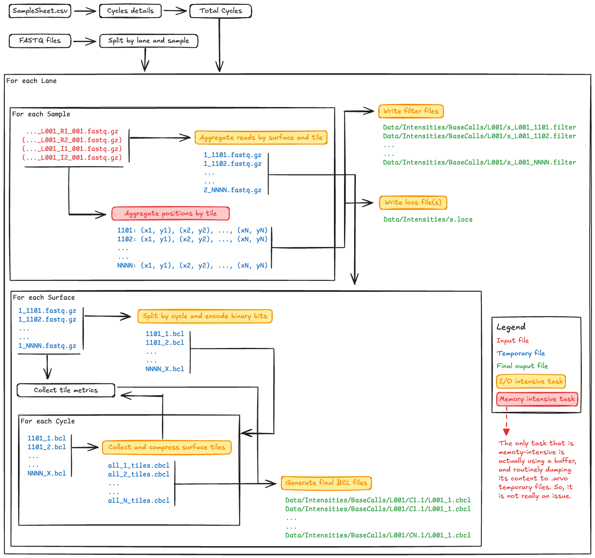

# FastRewind

This module allows to convert a series of FASTQ files back into the Illumina NovaSeqXPlus instrument outputs. It can be used to re-generate the whole or a subset of the flowcell output folder to be used for demultiplex testing purposes.

> _**IMPORTANT:** Due to the way the data must be read, processed and written, the procedure is mainly I/O bound. On a standard laptop, it takes ~2 hours to convert a 100M paired-end reads back into BCL files. Nevertheless, the certain I/O operation can be sped up by providing more than the default single-thread to the `dnaio` package to compressed and decompress inputs and outputs; this can be done via the `--threads` option. Finally, there are probably some other tweaks that can be implemented to shift the trade-off between in-memory and on-disk operations, though these have not been included since the idea is that the module should be able to run even on machine with limited resources._

## Usage

The minimal command is `biomate fastrewind --input <PATH>`. This will search for FASTQ file(s) and the SampleSheet.csv file, from which it will extract the information regarding the run (mainly, the number of cycles, and how they are split between reads and indexes).

## Options

- `--input-path`: Path to the input flowcell directory containing demultiplexed FASTQ files.
- `--output-path`: Path to the output directory where the BCL structure will be created (default: current directory).
- `--sample-sheet`: Path to the Sample Sheet file. If not provided, the script will look for SampleSheet.csv in the input directory.
- `--total-cycles`: The total number of cycles. If this is larger than the sequences in the samples, shorter samples will be filled with Ns.
- `--instrument`: The type of Illumina instrument, which will determine the type of outputs and folder structure. _Please, be aware that only the NovaSeqXPlus is currently supported._
- `--threads`: Number of threads used by dnaio to read/write files. Default is 0, which corresponds to a single thread.
- `--force`: Force overwrite of existing files in the output directory.

## Workflow Schematic Diagram



## Notes and References

The conversion between Python values and C structs represented as Python bytes objects was carried out using the [struct](https://docs.python.org/3/library/struct.html) package.

### Illumina Resources

- [Sequencing Outputs](https://support-docs.illumina.com/IN/NovaSeqX/Content/IN/NovaSeq/SequencingOutputFiles_fNV.htm)
- [Output Folder Structure](https://support-docs.illumina.com/IN/NovaSeqX/Content/IN/NovaSeqX/OutputFolderStructure.htm)
- [Quality Scores](https://support-docs.illumina.com/IN/NovaSeqX/Content/IN/NovaSeqX/RTAOverview.htm)
- [Flowcell Components](https://support-docs.illumina.com/IN/NextSeq_550-500/Content/IN/NextSeq/FlowCell_Tiles_fNS.htm)
- [bcl2fastq](https://support.illumina.com/content/dam/illumina-support/documents/documentation/software_documentation/bcl2fastq/bcl2fastq2-v2-20-software-guide-15051736-03.pdf)

### Encoding BCL Header and Nucleotides Examples

- [bcl2fastr](https://github.com/sstadick/bcl2fastr/blob/b9d990076ef58e1ca48552fc5b82dbf63e2ba734/pysrc/bcl2fastr/make_test_cbcls.py#L57)
- [well_duplicates](https://github.com/EdinburghGenomics/well_duplicates/blob/7d1a68dd359edf3c09937ca00a32ecd0b2549f58/bcl_direct_reader.py#L255)
- [picard](https://github.com/broadinstitute/picard/blob/master/src/main/java/picard/illumina/parser/readers/BaseBclReader.java#L104)

### Challenges related to the I/O

As mentioned above, the module is generating a lot of I/O pressure. This is due to the way the data must be transformed and aggregated, in order to re-create the original outputs.

FASTQ files are constituted by entries of four lines that include the read identifier, sequence and quality strings. However, each of these lines collects its information content from one or more lanes, several tiles and one or more surfaces. Indeed, when the instrument outputs are produced, the data belonging to individual reads is stored into separate files, and is then aggregated into the final FASTQ entries after running the demultiplexing tools, such as BCL-convert or bcl2fastq.

For example, the `Data/Intensities/BaseCalls` folder structure is organised in lanes sub-folders (e.g. `L001`, `L002`, etc.), and each of these contains cycle folders (e.g. `C1.1`, `C2.1`, `C3.1`, etc.). The latter contain a `.cbcl` file for each surface (e.g. `L001_1.cbcl`, `L001_2.cbcl`, etc.) that, in turn, encodes the nucleaotide and quality information for all tiles. This means that converting even a single read back into the files from which it derives would results in having to create and edit at least N (or N + N for paired-end reads) files, where N is the length of the read. The number of files can become as large as (N + N) _ T _ L \* S, where T, L, and S are the numbers tiles, lanes and surfaces, respectively.

Considering the type of structure, it seemed sensible to process the input files by lane, as this information is generally present in the FASTQ filename and, therefore, the inputs can be subset and grouped accordingly. Although one can think of sequentially working on and storing in-memory each lane data, this solution is rather unfeasible on non-HPC machines, such as laptops or workstations, due to the lower amout of memory at their disposal. So, the solution was to process all reads from FASTQ files belonging to one lane into separate files, then delete all the intermediate files and proceed with the next lane:

`Lane 1 --> Generate intermediate files --> Write to final outputs --> Delete intermediate files`

`Lane 2 --> Generate intermediate files --> Write to final outputs --> Delete intermediate files`

`Lane 3 --> Generate intermediate files --> Write to final outputs --> Delete intermediate files`

`...`

In addition, since the orginal data is produced without considering the experimental design, read pairs, indexes/barcodes and qualities must be merged into new reads. All sequences from the same read group are concatenated, as are all their qualities:

```text
>Read_1:1
CTAGCATG
+
I#IIIIII

>Read_1:2
CTAGCTCA
+
I#9IIIII

>Merged_read_1
CTAGCATGCTAGCTCA
+
I#IIIIIII#9IIIII
```

Finally, to understand into which file the resulting merged read should be written, the information must be extracted from the read identifier, which has the following structure:

`<instrument>:<run_number>:<flowcell_id>:<lane>:<tile>:<x_pos>:<y_pos> <read_index>:<is_filtered>:<control_number>:<index_sequence(s)>`

while the 4-digit `tile` label can be further split into:

`<surface_digit><swath_digit><tile_2digits>`

Since the nucleotide information is stored by tile inside the compressed BCL files and there is one BCL file per surface, it seemed reasonable to split, group and dump the reads into `<surface>_<tile>.fastq.gz` files. In fact, in the final step, these files will be read one at the time, by surface and tile, and the tiles will be written sequentially to `all_<cycle>_tiles.cbcl` files. Also in this case, the latter represent intermediate files that are, however, necessary since the header of the final `.cbcl` includes the information about the decompressed and compressed size of the collected and individual tiles blocks and, therefore, it can only be added once all the latter have been generated.
